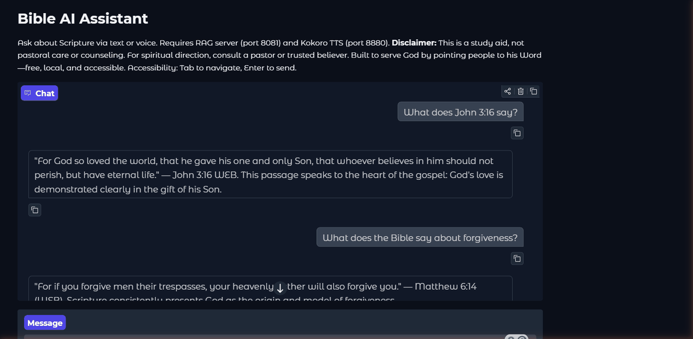

# Bible AI Assistant

A locally-hosted Bible Q&A assistant fine-tuned on Qwen3.5-4B with hybrid RAG retrieval, ORPO preference alignment, and optional voice interaction. Built end-to-end: dataset curation, training, evaluation, deployment.



---

## Key Skills Demonstrated

| Area | Details |
|------|---------|
| **LLM Fine-Tuning** | bf16 LoRA (Unsloth/PEFT/TRL) on Qwen3.5-4B; SFT on ~1,800 diverse examples + ORPO alignment on 500 preference pairs |
| **Retrieval-Augmented Generation** | Hybrid retrieval: ChromaDB dense search + BM25 sparse search + Reciprocal Rank Fusion + cross-encoder reranking (bge-reranker-v2-m3) |
| **Evaluation & Benchmarking** | 54-question eval suite across 6 categories; keyword-overlap + LLM-as-judge scoring; versioned benchmark protocol |
| **Model Quantization & Deployment** | GGUF export (F16 + Q4_K_M); Ollama serving; Jetson Orin Nano deployment guide |
| **MLOps & CI/CD** | GitHub Actions: lint (Ruff), unit tests (pytest, 183 tests, 55% coverage), security scan (pip-audit CVE + bandit SAST), Docker build validation across Python 3.10–3.12; W&B experiment tracking (34 runs) |
| **Production Hardening** | Optional API key auth, per-IP rate limiting (slowapi), `X-Request-ID` request correlation, structured JSON logging, Pydantic-validated settings, 1 MB request body guard |
| **Voice Pipeline** | Faster-Whisper STT (GPU/CPU fallback) + Kokoro TTS; Gradio 6 web UI |
| **Constitutional AI** | Behavioral guardrails grounded in biblical principles; counseling-pattern detection with safety referrals |

## Architecture

```
User (Gradio UI / curl / API client)
 │
 ├─ Gradio Web UI (port 7860)
 │   ├─ Text Chat ──────────────────────────┐
 │   └─ Voice Chat ── Faster-Whisper STT ──┘
 │                                          │
 │              ┌───────────────────────────┘
 │              ▼
 ├─ RAG Server (port 8081, FastAPI)
 │   ├─ Dense: ChromaDB + nomic-embed-text-v1.5
 │   ├─ Sparse: BM25Okapi
 │   ├─ Merge: Reciprocal Rank Fusion (k=60)
 │   ├─ Rerank: bge-reranker-v2-m3
 │   └─ Pinned verse refs + topical anchors
 │              │
 │              ▼
 ├─ Ollama (port 11434)
 │   └─ bible-assistant-orpo (Qwen3.5-4B SFT+ORPO, GGUF)
 │              │
 │              ▼
 └─ Response ── Kokoro TTS (optional) ── User
```

## Training Pipeline

### Stage 1: Supervised Fine-Tuning (SFT)

- **Base model:** Qwen/Qwen3.5-4B
- **Method:** bf16 LoRA (r=16, alpha=32, dropout=0.1)
- **Dataset:** ~1,800 examples across 7 categories (verse lookups, RAG-grounded, thematic, general, meta, multi-turn, refusals)
- **Config:** 3 epochs, batch size 2 (gradient accumulation 8), LR 2e-4, cosine schedule, 2048 seq length
- **Result:** Training loss 0.96 → 0.10 over 270 steps (~18 min on RTX 5070 Ti)

### Stage 2: ORPO Preference Alignment

- **Method:** Odds Ratio Preference Optimization (ORPO)
- **Dataset:** 500 preference pairs covering failure modes (hallucinated verses, instruction leaking, repetition, verbosity, off-topic Bible answers)
- **Config:** 1 epoch, 63 steps, LR 5e-6
- **Result:** Loss 1.19 → 0.69; reward accuracy 100% (model correctly distinguishes chosen vs rejected responses)

### Training Curves

| Metric | SFT Start | SFT End | ORPO Start | ORPO End |
|--------|-----------|---------|------------|----------|
| Training Loss | 0.96 | 0.10 | 1.19 | 0.69 |
| Learning Rate | 9.8e-5 | 2.5e-5 | 2.3e-6 | 4.7e-7 |

See [docs/MODEL_COMPARISON.md](docs/MODEL_COMPARISON.md) for full evaluation results comparing SFT-only vs. SFT+ORPO.

## Evaluation Results

Benchmarked on a 54-question evaluation suite across 6 categories using keyword-overlap scoring:

| Model | Size | Verse Accuracy | Citation Rate | Hallucination Rate |
|-------|------|----------------|---------------|--------------------|
| SFT-only (no ORPO) | 8.5 GB | N/A (incoherent) | N/A | N/A |
| SFT+ORPO (Q4_K_M) | 2.5 GB | 5.6% | 74% (40/54) | 20% (11/54) |
| SFT+ORPO (F16) | 8.5 GB | 9.3% | 87% (47/54) | 26% (14/54) |

> **Why ORPO matters:** Without preference alignment, the SFT-only model outputs gibberish. ORPO's 500 targeted preference pairs transform it into a coherent, citation-grounding assistant. The citation rate (74–87%) better reflects retrieval quality than the strict keyword-overlap verse accuracy metric. See [docs/MODEL_COMPARISON.md](docs/MODEL_COMPARISON.md) for full analysis.

## Repository Structure

```
bible-ai-assistant/
├── rag/
│   ├── rag_server.py     # FastAPI app: routes, auth, rate limiting, middleware
│   ├── helpers.py        # Pure string/regex helpers (no I/O — fully unit tested)
│   ├── retrieval.py      # Hybrid retrieval pipeline (dense + BM25 + RRF + rerank)
│   ├── settings.py       # Pydantic-validated config (reads from env / .env)
│   ├── response_cleanup.py
│   └── build_index.py    # ChromaDB index builder
├── training/             # SFT + ORPO training scripts, config.yaml
├── data/                 # Raw Bible JSON + processed training data
├── ui/                   # Gradio 6 web interface (text + voice)
├── voice/                # STT (Faster-Whisper) + TTS (Kokoro)
├── scripts/              # Benchmarking, leaderboard, testing
├── tests/                # 183 pytest tests across 8 test modules (55% line coverage)
├── prompts/              # System prompt + 54-question eval suite
├── deployment/           # PC, Jetson, VPS deployment configs + Dockerfiles
├── benchmarks/           # Versioned evaluation protocol (manifest.v1.yaml)
├── docs/                 # Guides, architecture, training results, model card
├── .github/workflows/    # CI: lint · test · security scan · Docker build
├── .pre-commit-config.yaml
├── pyproject.toml        # Project metadata, extras, tool config (ruff, bandit, pytest, coverage)
├── uv.lock               # Pinned dependency lockfile (207 packages)
└── .env.example          # Environment variable reference
```

## Quick Start

```bash
# 1. Clone and set up environment
git clone https://github.com/omnipotence-eth/bible-ai-assistant.git
cd bible-ai-assistant
conda create -n bible-ai python=3.11 && conda activate bible-ai
pip install -e ".[rag,ui]"

# 2. Configure environment (copy and edit)
cp .env.example .env

# 3. Build RAG index (requires Bible JSON in data/raw/)
build-index

# 4. Start services
ollama run bible-assistant-orpo          # Start model (Ollama must be installed)
rag-server                               # RAG server  → http://127.0.0.1:8081
python ui/app.py                         # Gradio UI   → http://localhost:7860
```

For the full step-by-step guide (training, merging, deployment): **[docs/WALKTHROUGH.md](docs/WALKTHROUGH.md)**

## Configuration

All runtime settings are read from environment variables (or a `.env` file). Copy `.env.example` to get started.

| Variable | Default | Description |
|----------|---------|-------------|
| `OLLAMA_URL` | `http://localhost:11434` | Ollama inference endpoint |
| `OLLAMA_MODEL` | `bible-assistant` | Model name served by Ollama |
| `RAG_HOST` | `127.0.0.1` | RAG server bind address |
| `RAG_PORT` | `8081` | RAG server port |
| `RAG_TOP_K` | `5` | Retrieved verses per query |
| `API_KEY` | _(empty)_ | Optional API key — auth disabled when blank |
| `RATE_LIMIT` | `60/minute` | Per-IP rate limit (slowapi format) |
| `LOG_LEVEL` | `INFO` | `DEBUG` / `INFO` / `WARNING` / `ERROR` |
| `LOG_JSON` | `false` | Set `true` for structured JSON logs in production |

## Testing

```bash
# Run all tests
pip install -e ".[dev]"
pytest tests/

# Run with coverage report
pytest tests/ --cov=rag --cov=training --cov-report=term-missing
```

The test suite comprises **183 tests** across 8 modules:

| Module | Tests | What it covers |
|--------|-------|----------------|
| `test_rag_helpers.py` | 32 | String helpers, verse normalization, query classification, thinking-block stripping |
| `test_rag_pure_functions.py` | 31 | URL validation, metadata stripping, SSE stream processing |
| `test_hypothesis.py` | 28 | Property-based tests (Hypothesis) on 5 pure helpers — idempotency, type invariants, length bounds |
| `test_evaluate_keyword.py` | 23 | Keyword scoring pipeline: citation detection, hallucination check, result persistence |
| `test_training_utils.py` | 41 | Score extraction/clamping, LoRA key remapping, preference pair structure, argparse error paths |
| `test_rag_api.py` | 10 | FastAPI endpoints: health check, 413/415/422 guards, API key auth, request correlation, Prometheus metrics, RAG bypass, counseling guardrail |
| `test_benchmark_manifest.py` | 4 | Benchmark manifest validation |
| `test_evaluation_questions.py` | 8 | Evaluation question set integrity |

**Line coverage: 55%** (CI fails the build if it drops below 50%). The uncovered 45% is the ML training pipeline and ChromaDB retrieval code, which require a GPU and a live database — those are covered by integration tests run separately.

## CI/CD

Every push and pull request runs four parallel jobs:

| Job | What it checks |
|-----|----------------|
| **Lint** | `ruff format --check` + `ruff check` across all source directories |
| **Test** | `pytest` with coverage enforcement (≥50%) on Python 3.10, 3.11, and 3.12 |
| **Security** | `pip-audit` CVE scan on all dependencies; `bandit` SAST on `rag/`, `training/`, `scripts/` |
| **Docker** | Builds `Dockerfile.rag` and `Dockerfile.ui` with Buildx cache — no push, validates the image builds cleanly |

## Documentation

| Document | Description |
|----------|-------------|
| [WALKTHROUGH.md](docs/WALKTHROUGH.md) | Step-by-step guide (Steps 1–12) |
| [MODEL_CARD.md](docs/MODEL_CARD.md) | Model card: training, evaluation, limitations, bias |
| [architecture.md](docs/architecture.md) | System design, phase deployment, lessons learned |
| [MODEL_COMPARISON.md](docs/MODEL_COMPARISON.md) | SFT vs. ORPO evaluation and analysis |
| [BENCHMARK_PROTOCOL.md](docs/BENCHMARK_PROTOCOL.md) | Versioned evaluation methodology |
| [CONSTITUTION.md](CONSTITUTION.md) | Biblical behavioral guardrails |
| [CONTRIBUTING.md](CONTRIBUTING.md) | Development workflow, branch conventions, PR process |
| [SECURITY.md](SECURITY.md) | Vulnerability reporting and responsible disclosure |
| [CHANGELOG.md](CHANGELOG.md) | Release notes |

## Hardware

| Component | Spec |
|-----------|------|
| GPU | NVIDIA RTX 5070 Ti (16 GB VRAM, Blackwell) |
| RAM | 64 GB DDR5 |
| OS | Windows 11 |
| Training time | ~18 min SFT + ~20 min ORPO |

## Author

**Tremayne Timms** — [GitHub](https://github.com/omnipotence-eth)

## License

Code: MIT. Model weights: Qwen license. Scripture text: public domain (WEB, KJV).
